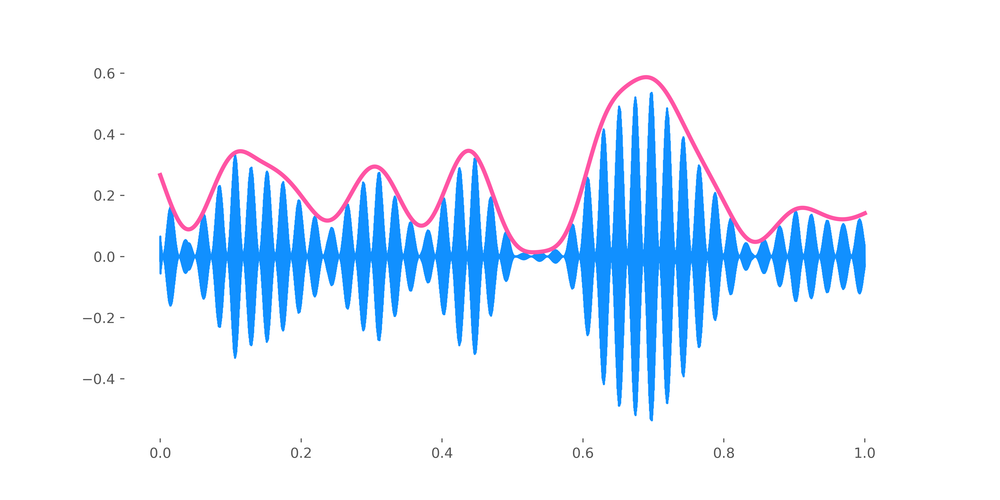

# Project background

This is the repository containing all the code needed to analyse the data presented on the poster for the conference *CuttingEEG* in Paris 2nd-5th July 2018.

The anonymised raw EEG data (`.bdf` files) will be made available as soon as possible.

The project is structured as following:

# Notebooks

- The notebook `createStimViz.ipynb` is where some vizualisations from sound are made.

- The notebook `preprocessing.ipynb` has to be run first to transform the raw `.bdf` files to the Numpy arrays containing the preprocessed data. It uses the file format `.h5` to store these data. It is compatible with Python and Matlab. Different datasets can be stored in each `.h5` file. In our case, we create one file per participant each containing:

1- eeg_TRF: data preprocessed for the stimulus reconstruction analyses

2- eeg_aSSR: data preprocessed for the aSSR analyses

3- envAttended: all attended envelopes (80 trials per participant = 320)

4- envUnattended all unattended envelopes (only from the exp 2 where there are two streams: 40 trials per participant = 160)

- The notebook `analyses_aSSR.ipynb` contains the analyses related to the aSSR. It uses data created by the notebook `preprocessing.ipynb`.

Some analyses have been done in R: see the file `behavior.Rmd`.

Stimulus reconstruction has been done in the file `analyses_TRF.m` with the package [mTRF](https://sourceforge.net/projects/aespa/) by Crosse et al.

# Tools

You can find in this folder all python functions used in the analyses. The file `audio.py` contains the audio processing functions (envelope extraction, fetch audio files from th database etc.). The file `behavior.py` contain functions related to behavior analyses. It goes from getting the data from couchDB to do analyses like d-prime calculation. The files `decodingSSR.py` and `decodingTRF.py` can be used to do the auditory steady-state response (aSSR) analyses and stimulus reconstruction. It includes functions used to prepare the data in a way required for the analyses. Finally, the file `eeg_utils.py` contains functions used for preprocessing, or loading the data.

# Credit

These analyses use the Matlab open source package `mTRF`:

You can find it [here](https://sourceforge.net/projects/aespa/).

Crosse, M. J., Di Liberto, G. M., Bednar, A., & Lalor, E. C. (2016). The Multivariate Temporal Response Function (mTRF) Toolbox: A MATLAB Toolbox for Relating Neural Signals to Continuous Stimuli. Frontiers in Human Neuroscience, 10, 604. http://doi.org/10.3389/fnhum.2016.00604

# API

You can find here the functions documentation.

## audio.py

#### `audioToNP(audioWebm, stream, verbose=False)`

Get a list of matrices containing audio from a list of webm file.

- **`audioList`** `array-like`

   List containing audio matrices. Its length is the number of trial
- **`audioLen`** `int`

   The number of samples in each trial.
- **`stream`** `str`

   Multiple sounds are associated with each trial.
Stream contains character to discriminate.
- **`verbose`** `bool`

   If True, more information are displayed.

Returns:

- **`audioList`** `array-like`

   List of matrices audio as elements.
- **`audioLen`** `int`

   Number of samples for each trial.

#### `butterLpass(data, cutoff, fs, order=5)`

Filter data with a low pass butterworth filter.

- **`data`** `instance of numpy.array`

   Matrix of shape (samples,) containing the signal to filter
- **`cutoff`** `float`

   The cutoff frequency in Hz.
- **`fs`** `float`

   The sampling frequency of the signal.
- **`order`** `int`

   Order of the filter.

Returns:

- **`y`** `instance of numpy.array`

    Matrix of shape (samples,) containing the filtered signal.

#### `downsampleTo64(data)`

Decimate data with a factor 750 to go from 48000 to 64 Hz.

- **`data`** `instance of numpy.array`

   Matrix to downsample.

Returns:

- **`newdata`** `instance of numpy.array`

   Downsampled matrix of shape (trial, time).

#### `fromWebmToWav(inputFile, filename, verbose=False)`

Convert webm file from database to wav by writing on disk. The files are
not removed.

- **`inputFile`** `webm file`

   Webm audio file to convert into wav.
- **`filename`** `str`

   Base name to use to store files on disk.
- **`verbose`** `bool`

   If True, more information are displayed.

Returns:

- **`allAudioFiles`** `array-like`

   List of all audio files corresponding to the session, db etc.

#### `getAttendedAndUnattendedEnv(dbAddress, dbName, password, verbose, fs=48000.)`

Get all envelopes required for the analyses. The function will return
3D matrices containing attended and unattended envelopes.

- **`dbAddress`** `str`

   Path to the couch database.
- **`dbName`** `str`

   Name of the database on the couch instance.
- **`password`** `str`

   Password of the couch database.
- **`verbose`** `bool`

   If True, more information are displayed.
- **`sessionNums`** `array-like`

   List of sessions to keep.
- **`stream`** `str`

   Stream to keep ('36' or '44').
- **`fs`** `float`

   Sampling frequency

Returns:

- **`attended`** `instance of numpy.array`

   Matrix of shape (trial, time) containing the envelope of all attended
streams.
- **`unattended`** `instance of numpy.array`

   Matrix of shape (trial, time) containing the envelope of all unattended
streams.

#### `getAudio(dbAddress, dbName, password, sessionNum, verbose=False)`

Get names of audio files from couchdb. This allows for instance to use the
names in the query to get the actual audio files.

- **`dbAddress`** `str`

   Path to the couch database.
- **`dbName`** `str`

   Name of the database on the couch instance.
- **`password`** `str`

   Password of the couch database
- **`sessionNum`** `int`

   Filter trials from a specific session number.

Returns:

- **`allAudioFiles`** `array-like`

   List of all audio files corresponding to the session, db etc.

#### `getAudioFilenames(dbAddress, dbName, password, sessionNum)`

Get names of audio files from couchdb. This allows for instance to use the
names in the query to get the actual audio files.

- **`dbAddress`** `str`

   Path to the couch database.
- **`dbName`** `str`

   Name of the database on the couch instance.
- **`password`** `str`

   Password of the couch database
- **`sessionNum`** `int`

   Filter trials from a specific session number.

Returns:

- **`allAudioFileNames`** `dict`

   Dictionary containing trial numbers as keys and array of audio file
names as values.

#### `getConcatAudio(audioList, trialLen, verbose=False)`

Get all audio files under the form of one concatenated matrix containing the
raw audio and another one containing the envelopes.

- **`audioList`** `array-like`

   List containing audio matrices. Its length is the number of trials.
- **`audioLen`** `int`

   The number of samples in each trial.
- **`verbose`** `bool`

   If True, more information are displayed.

Returns:

- **`audioAll`** `instance of numpy.array`

   Matrix of shape (samples,) containing all audio trials concatenated.
- **`audioAllEnv`** `instance of numpy.array`

   Matrix of shape (samples,) containing all audio envelopes concatenated.

#### `getEnv(dbAddress, dbName, password, verbose, sessionNums, fs, stream)`

Get the requested envelope corresponding to the user, sessionNum, stream etc.

- **`dbAddress`** `str`

   Path to the couch database.
- **`dbName`** `str`

   Name of the database on the couch instance.
- **`password`** `str`

   Password of the couch database.
- **`verbose`** `bool`

   If True, more information are displayed.
- **`sessionNums`** `array-like`

   List of sessions to keep.
- **`fs`** `float`

   Sampling frequency
- **`stream`** `str`

   Stream to keep ('36' or '44').

Returns:

- **`audioAllEnvFilt2DDS`** `instance of numpy.array`

   Matrix of shape (trial, time) containing the envelope filtered.

#### `getWebm(dbAddress, dbName, password, sessionNums)`

Get webm audio files from couchdb.

- **`dbAddress`** `str`

   Path to the couch database.
- **`dbName`** `str`

   Name of the database on the couch instance.
- **`password`** `str`

   Password of the couch database
- **`sessionNums`** `array-like`

   List of sessions to keep.

Returns:

- **`allAudioFiles`** `array-like`

   List of all audio files corresponding to the session, db etc.

#### `splitEnvInTrials(data, totalTrialNum, trialLen, verbose=False)`

Convert the concatenated array of sound to a 2D matrix of shape (trial, time).

- **`data`** `instance of numpy.array`

   Matrix of shape (samples,). Concatenated audio containing all trials in
one 2D matrix.
- **`totalTrialNum`** `int`

   The number of trials contained in the matrix data.
- **`trialLen`** `int`

   The number of sample of one trial (we expect same length trials).

Returns:

- **`newData`** `instance of numpy.array`

   Matrix of shape (trial, time).

## behavior.py

#### `analyses(data, verbose)`

Evaluate the behavior data by computing hits rate and false alarm rates. The
continuous responses given by the participant are compared to the time stamps
of the gaps in the attended stream and also in the unattended (if there is
one). For each response: 1.calculate the delay between this response and each
attended gap (`lagCorrect`). 2. calculate the delay between this response
and each unattended gap (`laginCorrect`). 3. keep only positive values in
each array because the response is done after the gap. This removes all
other gaps for this response. 4. take the smaller value in each
array: `minCorrect` and `minIncorrect`. 5. we consider that the response
is linked to the gap if the delay is between `minThresh` and `maxThresh`.
The margins should avoid having bumps in the two streams separated by less
than maxThresh - minThresh.

- **`data`** `instance of pandas.core.DataFrame`

   Behavior data to use to run the analyses.
- **`verbose`** `bool`

   Print more details about the process.

Returns:

   - **`analyses`** `instance of pandas.core.DataFrame`

Dataframe containing the number of hits and false alarms for each trial.

#### `checkLinkTrialsBehaviorEEG(trialBehavior, events, sessionNum, trigs, fs)`

Check that answer recorded in behavior data correspond to triggers emitted
by this answer. This allows to be sure that EEG data correspond to behavior.

- **`fs`** `float`

   EEG data sampling frequency in Hz.

Returns:

   

#### `getBehaviorData(dbName, sessionNums)`

Get behavior data from the couch database according to the name of the DB and
the sessions.

- **`dbName`** `str`

   Name of the database on the couch instance.
- **`sessionNums`** `array-like`

   List of sessions to keep.

Returns:

   - **`behaviorData`** `instance of pandas.core.DataFrame`

Dataframe containing all parameters of all trials.

#### `getBehaviorDataSession(dbAddress, dbName, sessionNum)`

Fetch behavior data from couchdb (SOA, SNR and trial duration).

- **`dbAddress`** `str`

   Path to the couch database.
- **`dbName`** `str`

   Name of the database on the couch instance.
- **`sessionNum`** `int`

   Behavior data will be fetched from this sessionNum.

Returns:

   - **`allDoc`** `instance of pandas.core.DataFrame`

A dataframe containing requested data.

#### `getTrialNum(ref, allSubj, trialBehavior, **kwargs)`

Get the trial numbers corresponding to specific conditions.

- **`ref`** `int`

   If 1: the condition is all trials (like for overall analyses: exp 1 and 2).
- **`allSubj`** `bool`

   Choose to return the trial number for one or all subjects.
- **`trialBehavior`** `instance of Pandas.Dataframe`

   All behavior data. Trial numbers will be find related to condition present
in this dataset.
- **`**kwargs`** `other arguments`

   All conditions can be passed as argument like `correctStream=[False]`.

Returns:

   - **`allTrials`** `instance of numpy.array`

List of trial numbers.

#### `plotTrial(data, correctBump, incorrectBump, gapNum, trial, hitTime, FATime, falseHitTime, resp)`

Plot representation of the behavior trial. This shows the gaps of attended
and unattended streams in green and red respectively and responses as
vertical gray lines.
still to implement...

Returns:

   - **`allTrials`** `instance of numpy.array`

List of trial numbers.

## decodingSSR.py

#### `calculateBaseline(data, fs)`

Calculate the baseline in order to take into account the fact that the eeg
response can be different for the two AM rates. This functions computes
the ratio between the AM rates in the one stream condition.

- **`eegData`** `instance of numpy.array`

   EEG data of shape (trial, time, electrode).

Returns:

   - **`ratio`** `float`

Ratio between the 36 Hz stream and the 44 Hz stream.

#### `comparePicks(data, fs)`

Calculate the baseline in order to take into account the fact that the eeg
response can be different for the two AM rates. This functions computes
the ratio between the AM rates in the one stream condition.

- **`eegData`** `instance of numpy.array`

   EEG data of shape (time, electrode).

Returns:

   - **`ratio`** `float`

Ratio between the 36 Hz stream and the 44 Hz stream.

#### `crossVal(data, data1, fs)`

This function has changed. To update...

- **`data`** `array-type`

   Shape (trial, time, electrode). Compute pick at 36 Hz for each trial.
- **`data1`** `array-type`

   Shape (trial, time, electrode). Compute pick at 44 Hz for each trial.
- **`fs`** `float`

   Sampling frequency in Hz.

Returns:

   - **`aAll`** `array-type`

List of pick values for 36 Hz from `data`. Length of trial number.
- **`bAll`** `array-type`

   List of pick values for 44 Hz from `data1`. Length of trial number.

#### `getBestAcc(durs, bestC)`

Return the c parameter corresponding to the better accuracy for the 4
participants and for each duration.

- **`durs`** `array-type`

   .List of durations to consider.
- **`bestC`** `instance of pandas.Dataframe`

   Dataframe returned from the function 'hyperOptC'.

Returns:

   - **`p1AccAll`** `array-type`

List of accuracies for each duration with the better c parameter
(at 60s) for the participant 1.
- **`p2AccAll`** `array-type`

   List of accuracies for each duration with the better c parameter
(at 60s) for the participant 2.
- **`p3AccAll`** `array-type`

   List of accuracies for each duration with the better c parameter
(at 60s) for the participant 3.
- **`p4AccAll`** `array-type`

   List of accuracies for each duration with the better c parameter
(at 60s) for the participant 4.

#### `getSSRAccuracyByDur(data, trials, fs)`

Get the classification accuracy according to duration of trials and trials used.

- **`data`** `array-type`

   Data to use to check accuracy.
- **`trials`** `array-type`

   Trials to consider.
- **`fs`** `float`

   Sampling frequency in Hz.

Returns:

   - **`allComparisons`** `array-type`

Array containing all comparison (for each duration).

#### `hyperOptC(data, c_vals, durs, electrodes, dprimeThresh, subjNum, condition, fs, trialBehaviorAll)`

Perform the hyper optimization of the c parameter of the SVM algorithm.
Also compute the accuracy for a set of durations.

- **`data`** `array-type`

   Data to use. Shape (trial, time, electrode).
- **`c_vals`** `array-type`

   List of c values to try.
- **`durs`** `array-type`

   List of durations to use.
- **`electrodes`** `array-type`

   List of electrodes to consider.
- **`dprimeThresh`** `float`

   Threshold of dprime to include the trial as a good trial.
- **`subjNum`** `array-type`

   List of subject to consider.
- **`condition`** `str`

   'oneStream' or 'twoStreams': choose the condition.
- **`fs`** `float`

   Sampling frequency in Hz.
- **`trialBehaviorAll`** `instance of pandas.Dataframe`

   Behavior data from all participants.

Returns:

   - **`bestC`** `instance of pandas.Dataframe`

Dataframe containing the accuracy for each c parameter and duration.

## decodingTRF.py

All functions used to do the decoding from stimulus reconstruction.

#### `calculateCorr(env1, env2, fs, end=None)`

Get correlations between env1 and env2 for each trials.

- **`env1`** `array-type`

   First list of envelope of shape (trial, time).
- **`env2`** `array-type`

   Second list of envelope of shape (trial, time).
- **`fs`** `float`

   Sampling frequency in Hz.
- **`end`** `float`

   End limit in seconds to take for each trial.

Returns:

- **`corrs`** `array-type`

   List of correlations of shape (trial, 1).

#### `getTRFAccuracyByDur(envAttended, envUnattended, envMismatch, envReconstructed, trials, trialsDualStream)`

Get the classification accuracy according to duration of trials and trials used.

- **`envAttended`** `instance of numpy.array`

   Attended envelopes. Shape (trial, time).
- **`envUnattended`** `instance of numpy.array`

   Unattended envelopes. Shape (trial, time).
- **`envMismatch`** `instance of numpy.array`

   Mismatch envelopes (corresponding to another trial). Shape (trial, time).
- **`envReconstructed`** `instance of numpy.array`

   Reconstructed envelopes. Shape (trial, time).
- **`trials`** `array-type`

   Trials to consider.
- **`trialsDualStream`** `array-like`

   Trials to consider in the exp 2 referential (attended vs unattended with
only 40 trials)

Returns:

   - **`classifMismatchTime`** `array-type`

List of classification accuracies (one value per second) for attended versus
mismatch stream.
- **`classifAtt_unattTime`** `array-type`

   List of classification accuracies (one value per second) for attended versus
unattended stream (only trials included in the dual stream part).

#### `getUnattendedTrialsNumber(trials)`

Get the trials for the condition dual streams. Since this condition was only from
trial 40 to 80 these trials not all trials have to be considered.

- **`trials`** `array-type`

   Trials to consider.
Returns:

- **`newEnv`** `array-type`

   Envelope of the selected trials of shape (trials, time).

## eeg_utils.py

#### `loadDataH5(path, pathReconstructed)`

Load data from .h5 file. This expects to load one file containing the EEG
and the envelopes of the stimuli and another file the reconstructed
envelope created from Matlab.

- **`path`** `str`

   Path to the `.h5` file containing EEG and stimuli envelopes.
- **`pathReconstructed`** `str`

   Path to the `.h5` file containing the reconstructed envelopes.

Returns:

   - **`eeg_TRF`** `instance of numpy.array`

A matrix of shape (trial, time, electrode) containing the data processed
for the TRF.
- **`eeg_TRF`** `instance of numpy.array`

   to do.
- **`envMismatch`** `instance of numpy.array`

   to do.
- **`envUnattended`** `instance of numpy.array`

   to do.
- **`envReconstructed`** `instance of numpy.array`

   to do.
- **`eeg_aSSR`** `instance of numpy.array`

   to do.

#### `processEEG(fnEEG, dbName, sessionNums, trialsToRemove, trialBehavior, fs, ref)`

Load and process EEG from .bdf file. The data is filtered according to
`freqFilter`, re-referenced according to the mastoids and downsampled
to 64 Hz if `downsampling` is set to True.

- **`fn`** `str`

   Name of the bdf containing the EEG data.
- **`dbName`** `str`

   Name of the database on the couch instance.
- **`sessionNums`** `array-type`

   List of sessions to keep.
- **`trialsToRemove`** `array-type`

   List of trials to remove from the analyses.
- **`ref`** `str`

   Choose between referencing to mastoids ('mastoids') or to the average
of all electrodes ('average').
- **`fs`** `float`

   Sampling frequency in Hz.

Returns:

   - **`dataFilt3D64`** `instance of numpy.array`

A matrix of shape (trial, time, electrode) containing the processed data.
